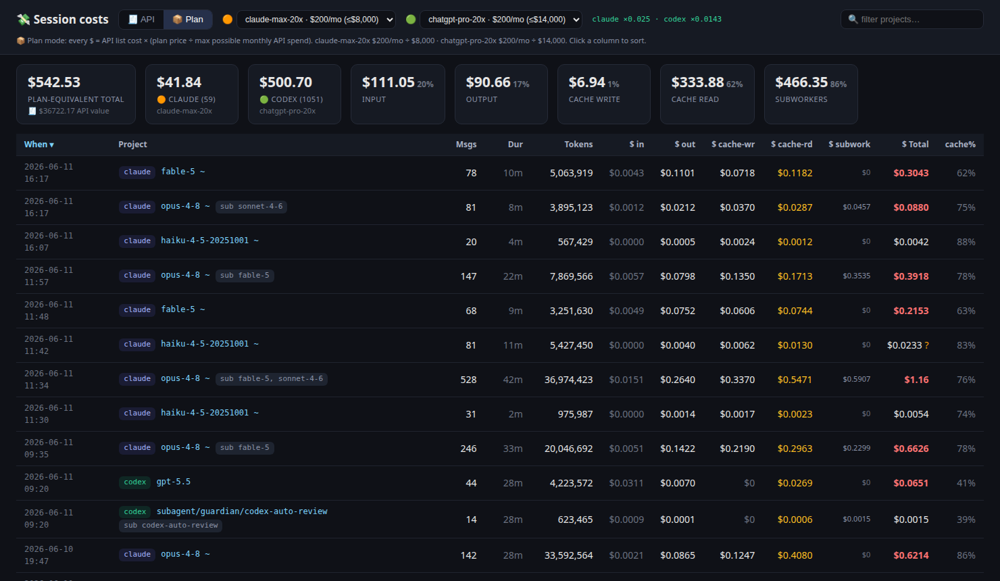
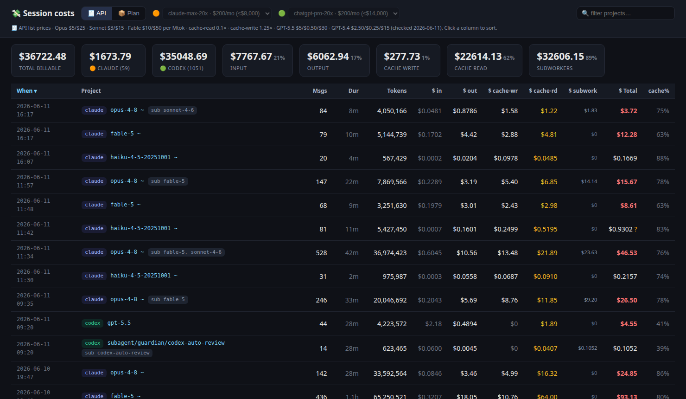
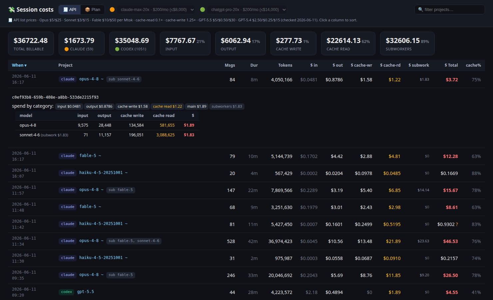

# 💸 claude-cost

A tiny, zero-dependency local dashboard that shows what every past **Claude Code** and **Codex** session would have cost you.

It scans your local session logs (`~/.claude/projects/**/*.jsonl` and `~/.codex/sessions/**/*.jsonl`), prices the token usage per model at API list prices, and serves a single-page dashboard.



## Features

- 📦 **Plan pricing** (default) — see your subscription's effective rate. Pick your Anthropic plan (Pro / Max 5× / Max 20×) and OpenAI plan (Plus / Pro 5× / Pro 20×); every dollar figure is scaled by *plan price ÷ max possible monthly API spend*, so you see the plan-equivalent cost of your usage. Mode and plan choices are remembered (localStorage)
- 🧾 **API pricing** — one click away: raw input / output / cache-write / cache-read priced per model (Opus, Sonnet, Haiku, Fable, GPT-5.x, …)
- 🤖 Subagent/sidechain work is merged into its parent session and broken out as "subwork"
- 📊 Per-session drill-down: per-model token counts, spend by category (input / output / cache write / cache read / main / subworkers)
- 🔍 Live project filter — totals cards recompute over the filtered rows
- ↕️ Sortable columns, duration, cache-hit share
- ⚡ mtime-cached scanning, so multi-GB log directories stay fast after the first load
- 🔗 Shareable URL params override the saved state: `?mode=api|plan&claude=<plan>&codex=<plan>&expand=<n>`

| API mode | Session drill-down |
|---|---|
|  |  |

## Run

```sh
node server.mjs            # → http://localhost:8799
PORT=9000 node server.mjs
```

No dependencies, no build step — one file, Node ≥ 18.

### Autostart (systemd user service)

```ini
# ~/.config/systemd/user/claude-cost.service
[Unit]
Description=claude-cost dashboard

[Service]
ExecStart=/usr/bin/node %h/CODE/claude-cost/server.mjs
Restart=on-failure

[Install]
WantedBy=default.target
```

```sh
systemctl --user enable --now claude-cost.service
```

## Plan-mode math

Plan mode answers: *"what did this usage effectively cost me at my plan's best-case rate?"*

| Plan | Price | Max possible spend (approx.) | Multiplier |
|---|---|---|---|
| claude-pro | $20/mo | $400/mo | ×0.05 |
| claude-max-5x | $100/mo | $2,000/mo | ×0.05 |
| claude-max-20x | $200/mo | $8,000/mo | ×0.025 |
| chatgpt-plus | $20/mo | $700/mo | ×0.0286 |
| chatgpt-pro-5x | $100/mo | $3,500/mo | ×0.0286 |
| chatgpt-pro-20x | $200/mo | $14,000/mo | ×0.0143 |

It's a lower bound implied by the max-spend column, not what you'd actually be billed.

## Privacy

Everything runs locally and reads only your own log files. Nothing leaves your machine — keep it bound to localhost.

## License

MIT
